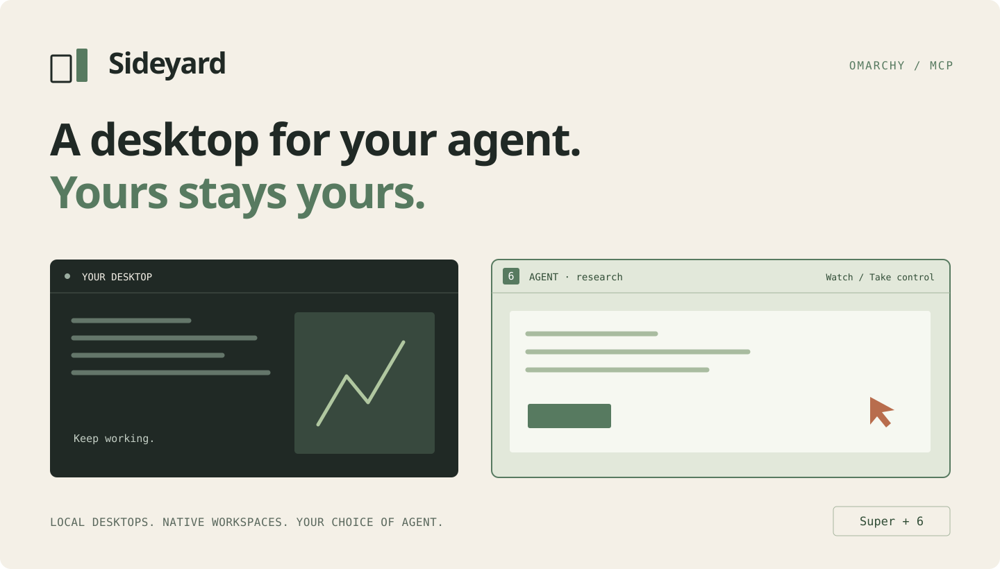

Sideyard gives your AI agent its own **native Omarchy workspace**. It can open
apps, inspect a screen and use the keyboard while you keep working. Switch over
with **Super+number**, watch, or take control from the top bar.

Built for Omarchy users who want an agent to test a UI, work in desktop apps, or
handle a visual task on their own machine. Bring any agent that supports local
MCP. Sideyard provides the desktop; your agent provides the intelligence.

- **A real workspace number.** The desktop fills the screen below your existing
  bar. An **AGENT** indicator makes ownership visible.
- **Easy handover.** Watch, take control, return to the agent, or stop. Old agent
  input is rejected when control changes.
- **A small MCP surface.** Eleven tools for the desktop lifecycle, apps, windows,
  screenshots, focus and input. Cropped images and automatic coordinate mapping
  keep the observe–act loop small.
- **A tidy lifecycle.** Keep files across restarts, attach a project directory, or
  delete a finished workspace from the panel. Attached projects are preserved.
- **Native styling.** The panel follows your Omarchy theme. New agent desktops
  get a quiet Sideyard wallpaper and fresh app profiles.

On an up-to-date Omarchy installation:

```sh
git clone https://github.com/itchyfeetleech/sideyard.git
cd sideyard
make install
sideyard start research --project "$PWD"
```

Keep the checkout in a permanent location; installation links to it. The build
needs `base-devel`, `wayland`, `libxkbcommon` and `wlr-protocols`. Runtime
packages are `python`, `hyprland`, `quickshell`, `sway`, `wayvnc`, `tigervnc`,
`grim`, `bubblewrap` and `dbus`. Run `sideyard doctor` to check dependencies.

Connect an MCP client using the following configuration, replacing the home
path with your own:

```json
{
  "mcpServers": {
    "sideyard": {
      "command": "/home/YOUR_USER/.local/bin/sideyard",
      "args": ["mcp"]
    }
  }
}
```

Try: “Start a Sideyard workspace called research, launch a browser, and inspect
my app.” MCP starts in agent control with a read-only viewer; creating a desktop
from the panel gives you control. The existing `aw` command remains an alias.

```sh
sideyard launch research -- foot
sideyard control research agent
sideyard open research
sideyard stop research
sideyard delete research --yes
```

**Stop** preserves the desktop’s files. **Delete** removes its private files and
profiles after closing its apps; an attached project directory is kept. The
panel asks for confirmation before deletion.

Sideyard currently targets Omarchy 4.0.3 / Hyprland 0.56.2 with Lua configuration
and runs up to two desktops. It uses a nested Hyprland desktop, a private
Bubblewrap namespace and a packaged VNC viewer on a normal host workspace.
This separates display and input; it is **same-user isolation**, with readable
host files and writable attached projects. Use it for trusted work. Apps inside
the desktop need Wayland support.

[Usage, tools and troubleshooting](docs/usage.md) ·
[MIT license](LICENSE)

To work on the code, run `make check`. The small regression suite covers input
ownership, process identity, frame mapping and deletion boundaries. Run
`python3 tests/smoke.py` on Omarchy for the real desktop check (up to two free slots); it opens a
viewer and removes its temporary desktops afterward. `make uninstall` removes
the CLI and widget and keeps workspace data.
